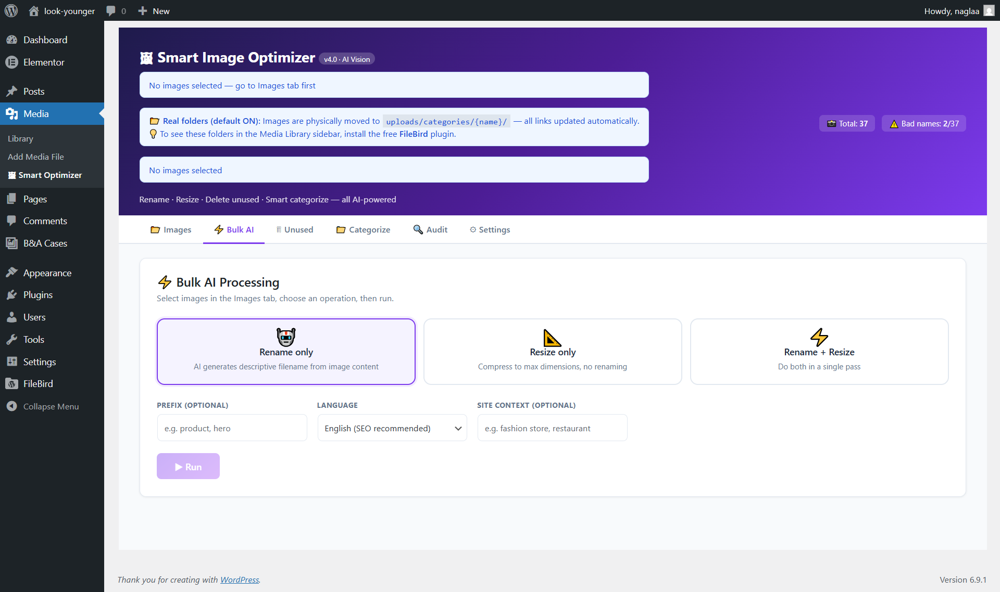

# Smart Image Optimizer

**Version:** 4.0.0
**Author:** naglaa mossleh
**Requires:** WordPress 5.0+, PHP 7.4+

AI-powered WordPress plugin for managing your media library. Rename images with SEO-friendly names, resize them, find and delete unused files, auto-categorize into folders, audit broken references, and now manage your video library with AI SEO metadata and thumbnail extraction — all from one admin page.

---

## Screenshot



---

## Features

### Image Browser

- Grid view of all media library images with thumbnail previews
- Search by filename, filter by name quality (all / bad filenames / large +300 KB), and paginate results
- Select individual images or all visible images for bulk operations
- Highlights images with poor filenames (generic names like `IMG_1234`, `WhatsApp Image`, etc.)

### AI Rename

- Send an image to an AI provider and get a descriptive, SEO-friendly filename back
- Preview and edit the suggested name before saving
- Automatically updates all references to the old filename across the entire database
- Sets alt text, caption, and description on the attachment after renaming

### Manual Rename

- Rename any image by hand via a modal dialog
- All internal links, post content, and metadata are updated sitewide automatically

### Resize

- Resize images individually or in bulk
- Four resize modes:
  - **Fixed height** — scales uniformly to a target height (recommended)
  - **Max width** — scales down to a maximum width while preserving ratio
  - **Crop** — crops to an exact width x height
  - **Fixed width & height** — stretches/squishes to exact dimensions
- Supports both upscale and downscale
- Reports old vs. new dimensions and KB saved

### Bulk Operations

- Select any number of images from the browser, then run one of:
  - **Rename** — AI renames all selected images
  - **Resize** — resizes all selected images
  - **Rename + Resize** — does both in one pass
- Processes in batches with a live progress bar and per-image log

### Video Manager

- Browse all videos in the media library with search and pagination
- Displays file size (MB), duration, resolution, and MIME type for each video
- **AI SEO** — generates an SEO-optimized title, slug, description, and tags from the video filename using your configured AI provider (text-based, no vision API needed)
- **Screenshot / Thumbnail** — extracts a frame from a video and sets it as the video's featured image using one of three methods:
  1. FFmpeg (best quality, requires FFmpeg on the server)
  2. WordPress built-in video metadata reader (if available)
  3. Embedded MP4 cover art (GD extraction from moov atom)
- Shows a notice if FFmpeg is not detected on the server

### Unused Image Scanner

- Scans all post content, metadata, and options to find images not referenced anywhere
- Displays a grid of unreferenced images with their file sizes
- One-click bulk delete to recover disk space

### Smart Categorize

- AI analyzes selected images and groups them into semantic categories
- Categories are saved as a WordPress `media_cat` taxonomy on each attachment
- Optional: physically move image files into `uploads/categories/{name}/` subfolders, with all database references updated automatically

### Reference Audit

- Enter an old filename to scan every database table for references to it
- Shows which tables and rows contain the filename
- Enter a new filename and fix all references in one click

### Settings

- Choose your AI provider:
  - **Groq** (free tier available) — uses Llama 4 Vision (`meta-llama/llama-4-scout-17b-16e-instruct`)
  - **Google Gemini** — tries `gemini-1.5-flash-8b` → `gemini-1.5-flash` → `gemini-2.0-flash-lite` → `gemini-2.0-flash` with automatic fallback
  - **Anthropic Claude** — choose between `claude-haiku-4-5-20251001` (fast) or `claude-sonnet-4-6` (accurate)
- Per-provider API key storage (masked input with show/hide toggle)
- Test connection button to verify your key before running bulk jobs
- Rename language setting — generate filenames in any language
- Optional context field — describe your site to improve AI name suggestions

---

## Installation

1. Upload the `smart-image-optimizer` folder to `wp-content/plugins/`.
2. Activate the plugin in **Plugins > Installed Plugins**.
3. Go to **Media > Smart Optimizer**.
4. Open the **Settings** tab, select an AI provider, enter your API key, and click **Save**.
5. Click **Test Connection** to confirm the key works.

---

## Requirements

| Requirement     | Minimum                        |
| --------------- | ------------------------------ |
| WordPress       | 5.0                            |
| PHP             | 7.4 (uses typed properties)    |
| GD or Imagick   | Required for resize operations |
| AI provider key | Groq, Gemini, or Anthropic     |
| FFmpeg          | Optional — required for video screenshot extraction |

---

## AI Provider Comparison

| Provider         | Cost                | Notes                                                          |
| ---------------- | ------------------- | -------------------------------------------------------------- |
| Groq             | Free tier available | Fast inference; uses Llama 4 Scout Vision                      |
| Google Gemini    | Free tier available | Auto-falls back across flash models; free in some regions      |
| Anthropic Claude | Paid                | Haiku (fast, ~$0.001/image) or Sonnet (accurate); best results |

---

## How Renaming Works

1. The plugin renames the physical file on disk.
2. It updates the `post_title`, `post_name`, `post_excerpt`, `post_content`, `guid`, and `_wp_attached_file` / `_wp_attachment_metadata` fields in the database.
3. It sets the `_wp_attachment_image_alt` meta (alt text) to the human-readable version of the new slug.
4. It runs a search-and-replace for the old filename across `post_content`, `post_excerpt`, `postmeta`, `options`, `termmeta`, and `usermeta` tables.
5. The count of updated database rows is shown after each rename.

> **Note:** Always back up your site before running bulk rename or delete operations. These actions cannot be undone.

---

## File Structure

```
smart-image-optimizer/
  smart-image-optimizer.php   # Main plugin file (PHP backend + AJAX handlers)
  assets/
    app.js                    # Frontend JavaScript (jQuery)
    style.css                 # Admin UI styles
```

---

## Permissions

The plugin admin page requires the `manage_options` capability (Administrator role by default).

---

## Changelog

### 4.0.0

- Added **Video Manager** tab — browse, AI-SEO, and screenshot extraction for video attachments
- Added AI SEO metadata generation for videos (title, slug, description, tags)
- Added video thumbnail extraction via FFmpeg, WordPress metadata, or embedded MP4 cover art
- Added smart categorize with optional folder organization
- Added reference audit tool
- Added multi-provider AI support (Groq with Llama 4 Vision, Gemini with model fallback, Claude Haiku/Sonnet)
- Added bulk rename + resize in a single pass
- Added connection test for API keys
- Rename now updates alt text, caption (post_excerpt), and description (post_content)
- Resize supports both upscale and downscale in all modes
- Redesigned UI with tabbed layout (Images, Videos, Bulk AI, Unused, Categorize, Audit, Settings)
